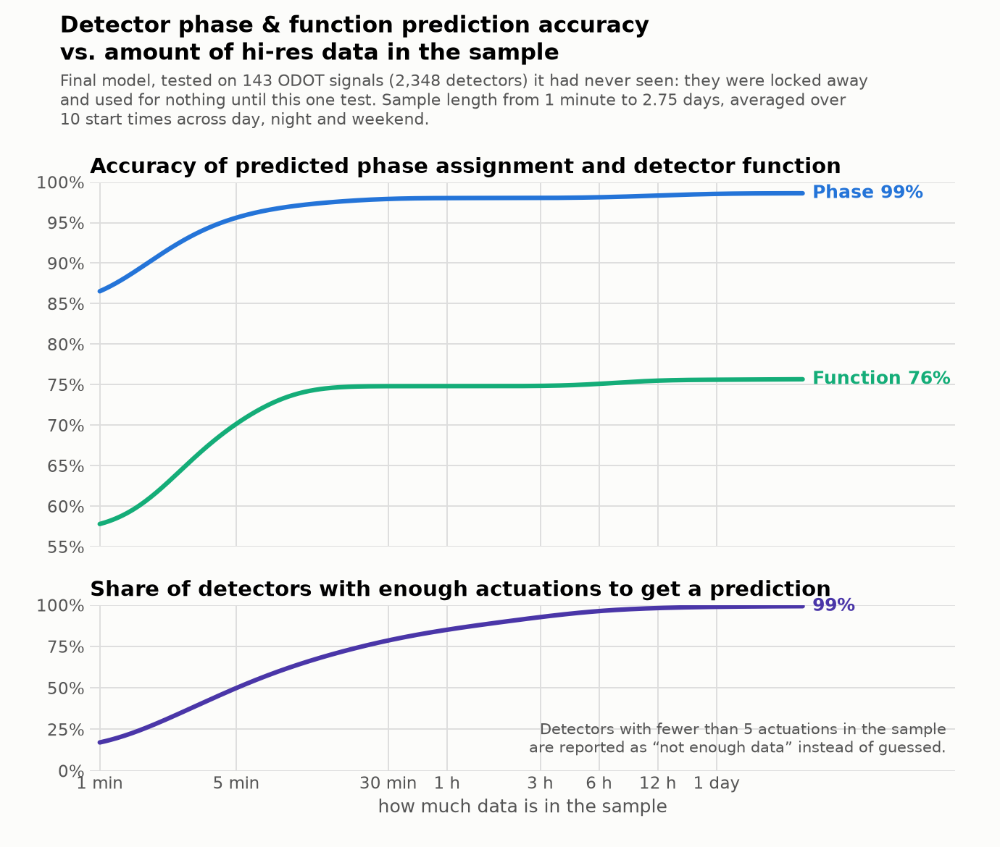

# detector-classifier

Give this tool raw hi-res traffic-signal controller events and it tells you, for every vehicle
detector channel, which **phase** it is wired to and what its **function** is (Advance / Presence /
Count / Yellow_Red / Other), with a probability and a plain-English status for each. It never sees a
phase number or a channel number — it judges a detector purely by how it behaves — so it also works
on cabinets wired against local convention. CPU only, no GPU, no database, no training step.

## How well it works

186 signals were locked away from the whole study and scored after the model was frozen. On the
larger set (143 signals, 2,348 labelled detectors, truth = the controllers' own timing database):

| sample length | 30 min | 1 h | 6 h | full 66 h |
|---|---|---|---|---|
| **phase accuracy** | **.9815** | **.9838** | **.9825** | **.9862** |

About 91 % of labelled channels get an answer from thirty minutes of data and 99 % from the full
span — the rest are too quiet to judge. Keeping only answers with `phase_prob >= 0.9` gives
**99.6 %** on 92 % of the answered detectors at 30 minutes. Detector **function** is the weaker
half: .75–.82 over five classes, .78–.86 over the three common ones, measured on the 321–729
channels per set that carry a function label. The other two locked sets score .968–.979 on phase.
Detail: `research/notes/12_final_model.md` and `13_gru_blend.md`.



## Deploy

```bash
pip install -r model/requirements.txt      # duckdb, pandas, numpy, pyarrow, onnxruntime
python model/check.py                      # verifies the install reproduces the stored answers
python model/predict.py --events events.parquet --out preds.csv \
  [--start "2026-09-21 08:00:00"] [--end "..."] [--device-ids <guid>,<guid>] \
  [--chunk-signals 10] [--min-actuations 5] [--min-prob 0.9]
```
```python
import sys; sys.path.insert(0, "model")
from predict import predict
out = predict(events_df_or_path, start=None, end=None)   # -> one row per detector
```

**Input.** Columns `DeviceId, Timestamp, EventId, Parameter` (lowercase/underscore spellings also
accepted); a DataFrame, a file or a glob, parquet or csv; any number of signals, any span from
minutes to days. Filtering, de-duplication, pairing and features all happen inside. Pull this:

```sql
WHERE EventId IN (1,7,8,9,10,11,43,44,81,82,83,84,85,86,87,88,131,150,173)
  AND NOT (EventId IN (81,82) AND Parameter > 64)
```

| EventId | name | need | if missing |
|---|---|---|---|
| 82 / 81 | Detector On / Off | **required** | nothing can be classified |
| 1 | Phase Begin Green | **required** | no candidate phases → "cannot classify" |
| 43 | Phase Call Registered | **strongly recommended** | −18 to −22 pt phase, −17 pt function |
| 8 | Phase Begin Yellow (green end) | recommended | falls back to 7 |
| 7 | Phase Green Termination | fall-back for 8 | with 7 only (no 8/9/10/11): −0.4 pt phase |
| 10 / 9 | Begin Red Clearance / End Yellow | recommended | fall back to each other |
| 11 | End Red Clearance | used by the function model | −0.2 pt function, weaker Yellow_Red |
| 44 | Phase Call Dropped | optional | −0.5 to −0.9 pt |
| 83–88 | detector restored / fault | optional | only the detector-health note is lost |
| 131 | Coordination Pattern Change | optional | no measurable effect |
| 150 / 173 | yield point / unit flash | read, not used | no effect |

A cheap pull of just **1, 7, 43, 44, 81, 82** costs about 0.4 points of phase accuracy.

**Output**, one row per channel: `DeviceId, Detector, phase_pred, phase_prob, phase_2nd,
phase_2nd_prob, function_pred, function_prob, status, review_flag, n_actuations, minutes_of_data`,
plus `phase_guess, phase_guess_prob, function_guess, function_guess_prob, phase_margin, p_advance,
p_presence, p_count, p_yellow_red, p_other, n_candidate_phases, health_flag, review_reason`.

**Thresholds.** Auto-accept `phase_prob >= 0.9` and send the rest to review; `function_prob >= 0.8`
is the comparable line, and `review_flag` is true whenever `status` is not exactly `ok`. Two dials
control when the model refuses to answer at all: `--min-actuations 5` (the default) refuses a
detector with fewer than five ON events, `--min-prob` (off by default) refuses on confidence
instead. On short samples `--min-actuations 1 --min-prob 0.9` answers *more* detectors at 2.5 points
higher accuracy. Nothing is lost either way — the opinion stays in `phase_guess` / `function_guess`.

**Footprint.** 21 MB on disk. About **0.6 s per signal** for a 30-minute sample; a 24-hour sample
costs *less*, because the neural half is switched off above two hours (143 signals × 2¾ days, 51 M
events, took 135 s end to end). Roughly 210 MB of RAM per signal, plus up to ~1 GB transient while
the network batches detector/phase pairs. `--chunk-signals N` bounds peak memory — it scales with
the chunk, not the job — so a whole state can be processed on a laptop.

## Layout

    model/        everything needed to run the model: predict.py, its helper modules,
                  weights/, requirements.txt, a bundled sample and check.py
    research/     kept for posterity — notes/ (one per research stage), charts/, code/
    REPORT.md     what was tried and what was learned          AGENTS.md  rules for AI agents
