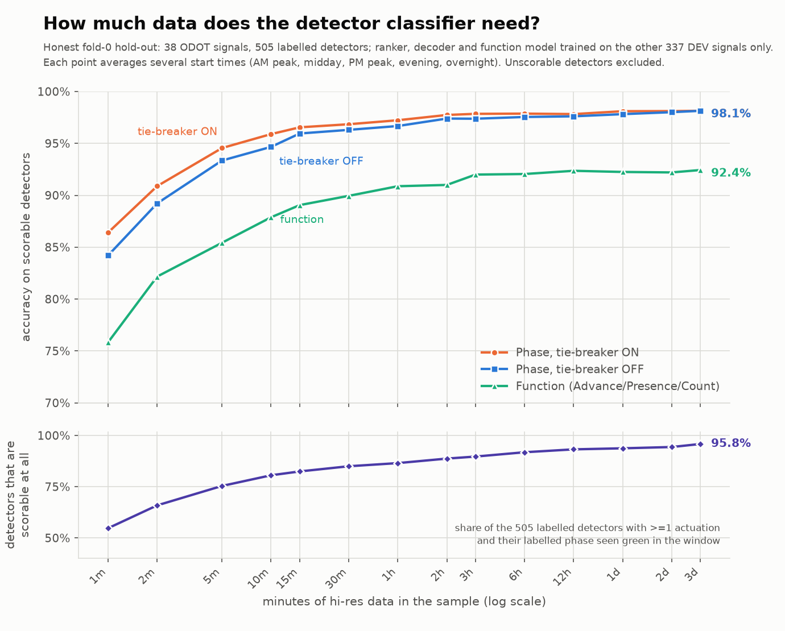

# Detector classifier — BETA (`models/beta_v0`, 2026-09-17)

**What it does.** Give it raw hi-res controller events; for every vehicle detector channel it returns
the **phase** it is wired to, its **function** (Advance / Presence / Count / Other), a confidence for
each, and a status saying whether it could be classified at all. It never sees a phase number or a
channel number as an input — it judges a detector by how it behaves against each phase's green/red
and calls, and by which other detectors it fires with. Pipeline: LightGBM pair ranker → LightGBM
joint per-signal decoder → optional ODOT standard-wiring tie-breaker (off by default) → LightGBM
function model + detector-health status.

## Headline accuracy, and the train / held-out / TEST check

Accuracy **excludes unscorable detectors** — zero actuations in the window, or the labelled phase
never green in it. DEV = 375 signals, 5,171 labels; at 72 h 349 are unscorable (298 dead + 51
label-never-green) leaving **4,822**; at 30 min 701 unscorable leaving **4,469**.
"Held out" = 6-fold grouped OOF by signal. TEST = the 43 untouched signals (590 labels, 548 scorable
at 72 h), scored **once** with the model already frozen, at the user's explicit authorisation.

| | in-sample (trained on) | **held out (DEV 6-fold OOF)** | TEST 43 signals |
|---|---|---|---|
| ranker only, 72 h / 30 min | .9952 / .9805 | .9749 / .9432 | .9836 / .9486 |
| **+ decoder (default), 72 h / 30 min** | .9954 / .9834 | **.9818 ±.0056 / .9624 ±.0051** | .9872 / .9684 |
| + ODOT tie-breaker, 72 h / 30 min | .9954 / .9849 | .9826 ±.0046 / .9661 ±.0054 | .9872 / .9758 |
| **function**, 72 h / 30 min | .9380 / .9153 | **.8970 ±.0209 / .8799 ±.0254** | .9013 / .8879 |
| non-standard-wired detectors, 72 h | .975 (n=590) | .9203 (n=590) | .9189 (n=37) |
| old "all labelled" figure (decoder, 72 h) | .9283 | .9155 | .9169 |

A ~1.5-point in-sample/held-out gap is normal for gradient-boosted trees; what matters is the
held-out number and its stability — per-fold spread is only ±0.5 pt, and **TEST scores slightly
*above* the DEV OOF**, so nothing is tuned to DEV. On fold 0 (the 2025 model's own hold-out) this
beta gets **.9793 phase / .9305 function** vs the 2025 BiLSTM's **.9525 / .9059**.
No TEST error analysis was done and no TEST detector is in any review list; predictions live only in
`dc_work/preds/beta_test_DO_NOT_USE/`. **TEST stays reserved for the single final scoring of the
study, which is still pending — and the neural models are still being evaluated.**

## How much data does it need?



Honest hold-out: ranker, decoder and function retrained on DEV folds 1–5 (337 signals) only and
scored on fold 0's 38 signals / 505 labels; each duration averages several start times (AM peak,
midday, PM peak, evening, overnight). All numbers: `img/accuracy_vs_minutes.json`.

| minutes | 1 | 5 | 15 | 30 | 60 | 360 (6 h) | 4320 (72 h) |
|---|---|---|---|---|---|---|---|
| phase, tie-breaker OFF | .842 | .934 | .960 | .963 | .967 | .976 | .981 |
| phase, tie-breaker ON | .864 | .946 | .966 | .969 | .972 | .979 | .981 |
| function | .758 | .854 | .891 | .900 | .909 | .921 | .924 |
| detectors scorable at all | 55 % | 75 % | 82 % | 85 % | 87 % | 92 % | 96 % |

By evidence instead of clock time (phase / function): <5 actuations .881/.805 · 5–10 .928/.866 ·
10–25 .955/.895 · 25–100 .968/.918 · >100 .978/.921. **Actuations are the driver, not duration.**
Adding 5- and 10-minute windows to the training mix helped at every duration (+4.7 pt at 1 min,
+1.5 at 5 min, +0.2 at 72 h), so that is the model shipped, retrained on all 375 DEV signals.

## What it does to your raw data (all of it, automatically)

1 keep only the allowed event codes · 2 drop `Parameter > 64` on 81/82 (dummy channels) ·
3 `SELECT DISTINCT` (≈2 % of 81/82 rows are exact duplicates) · 4 pair each 82 with the next 81 → ON
intervals · 5 build phase cycles and a per-signal green bitmask timeline · 6 candidate phases = every
phase with a Begin Green in the window · 7 coordination state from 131 · 8 ~260 duration-invariant
pair features + the 2-second actuation-similarity graph between channels · 9 rank, decode, tie-break,
classify function · 10 health flags → `status` / `review_flag`.

| EventId | name | Parameter | need | if missing |
|---|---|---|---|---|
| 82 / 81 | Detector On / Off | detector channel | **required** | nothing can be classified |
| 1 | Phase Begin Green | phase | **required** | no candidates → "cannot classify" |
| 8 | Phase Begin Yellow | phase | **required in practice** (green end) | falls back to 7 |
| 10 | Phase Begin Red Clearance | phase | strongly recommended (red start) | falls back to 9 |
| 7 | Phase Green Termination | phase | fall-back for 8 | 7 present, 8/9/10/11 absent: **−0.4 pt** |
| 9 | Phase End Yellow | phase | fall-back for 10 | as above |
| 11 | Phase End Red Clearance | phase | read, not used | no effect |
| 43 | Phase Call Registered | phase | **strongly recommended** | **−18 to −22 pt** phase, −17 function |
| 44 | Phase Call Dropped | phase | optional | −0.5 to −0.9 pt |
| 83–88 | detector restored / fault | detector channel | optional | only the "suspect" health flag is lost |
| 131 | Coordination Pattern Change | pattern (0/254 free, 255 flash) | optional | no measurable effect |
| 150 | Coordinated Phase Yield Point | phase | read, **not used** | no effect |
| 173 | Unit Flash Status | — | read, **not used** | no effect |

Measured end to end on 38 signals at 30 min and 3 h by deleting each code from the log. With **only
1 + 81/82** (no 7–11, no 43/44) expect −3 pt phase and −17 pt function. Pull exactly what is used:

```sql
WHERE EventId IN (1,7,8,9,10,11,43,44,81,82,83,84,85,86,87,88,131,150,173)
  AND NOT (EventId IN (81,82) AND Parameter > 64)
```
```python
ev = ev[ev.EventId.isin([1,7,8,9,10,11,43,44,81,82,83,84,85,86,87,88,131,150,173])
        & ~(ev.EventId.isin([81,82]) & (ev.Parameter > 64))]
```

## How to call it

```bash
pip install -r requirements-inference.txt
python src/predict.py --events events.parquet --out preds.csv \
  [--start "2024-12-03 08:00:00"] [--end "..."] [--device-ids <guid>,<guid>] \
  [--odot-tiebreak] [--chunk-signals 5]
```
```python
import sys; sys.path.insert(0, "src")
from predict import predict
out = predict(events_df_or_path, start=None, end=None, odot_tiebreak=False)
```
Input columns `DeviceId, Timestamp, EventId, Parameter` (or `device_id, timestamp, event_id,
parameter`), one or many signals, minutes to days. Models load from `models/beta_v0/`; no absolute
paths. Smoke test: `python tests/test_predict_smoke.py`.

## Using the output (one row per detector channel)

`phase_pred, phase_prob, phase_2nd, phase_2nd_prob, function_pred, function_prob, status,
review_flag, n_actuations, minutes_of_data, tiebreak_applied` (+ `phase_margin`,
`p_advance/p_presence/p_count`, `n_candidate_phases`, `health_flag`, `review_reason`).

| keep if `phase_prob` ≥ | 0.5 | 0.7 | 0.8 | **0.9** | 0.95 |
|---|---|---|---|---|---|
| 72 h — coverage · accuracy | 99.8 % · .983 | 98.7 % · .987 | 97.9 % · .988 | **96.0 % · .991** | 94.0 % · .992 |
| 30 min — coverage · accuracy | 98.8 % · .970 | 95.7 % · .981 | 93.8 % · .985 | **90.0 % · .989** | 85.6 % · .991 |

Auto-accept `phase_prob ≥ 0.9` (~99 % right, ~96 % of detectors at 72 h) and review the rest;
`function_prob ≥ 0.7` keeps 90 % of detectors at 93 % accuracy.

* **`--odot-tiebreak`**: only for cabinets wired to the ODOT standard, and it only earns its keep on
  short samples (+0.4 pt at 30 min, +0.1 at 72 h). It fires only when the top two candidates are a
  concurrent pair within the margin *and* the signal's own confident predictions already agree with
  the standard table. Over 150 switches on DEV it helped 143 and hurt 6 — **all 6 harmed detectors
  were non-standard ones**. Leave it off if field wiring may differ from the plan; `tiebreak_applied`
  shows where it fired.
* **`function_pred = "Other"`**: none of Advance/Presence/Count reached 0.6 — usually a bike,
  mid-block, special or combined detector. Treat as "look at this one".
* **`status`**: `ok`, a `cannot classify: …` message (no actuations, stuck on, chattering, no phase
  green events — `phase_pred` is then blank), or low-evidence warnings (few actuations, short sample,
  no 43/44 in the log, detector-health concern, phase probability below 0.5). `review_flag` is true
  whenever `status` is not `ok`.

## Footprint (CPU only, 4 DuckDB threads, 4 GB limit)

Models on disk **3.7 MB** (`models/beta_v0/`: 3 LightGBM boosters + metadata + model card).

| case | wall (predict) | peak RSS |
|---|---|---|
| 1 signal × 30 min (7 k events) | 0.7 s | 218 MB |
| 1 signal × 24 h (261 k events) | 1.0 s | 256 MB |
| 20 signals × 24 h (5.2 M events) | 6.2 s (4.2 s at 8 threads) | 1.17 GB |
| 20 signals × 24 h, `chunk_signals=5` | 7.6 s | 533 MB |

Plus ~2–3 s of imports once per process. **To bound memory pass `chunk_signals=N`** — peak RSS scales
with the chunk, not the job, so a whole state can be processed on a laptop by looping in chunks.

## Known limitations

* Labels are noisy: confident model-vs-label disagreements suggest a practical ceiling near 99 %, so
  roughly half the remaining phase error is probably the config file, not the model.
* Non-standard-wired detectors are ~7 points worse than standard ones (.920 vs .990 at 72 h).
* Function is the weaker head (~.90) and the **"Other" threshold 0.6 is not yet validated** — the
  Dec-2024 labels contain only Advance/Presence/Count.
* Trained only on ODOT signals, Indiana hi-res enumerations, December weekdays.
* No actuations in the window = no answer possible: 45 % of channels at 1 min, 15 % at 30 min, 4 % at 72 h.
