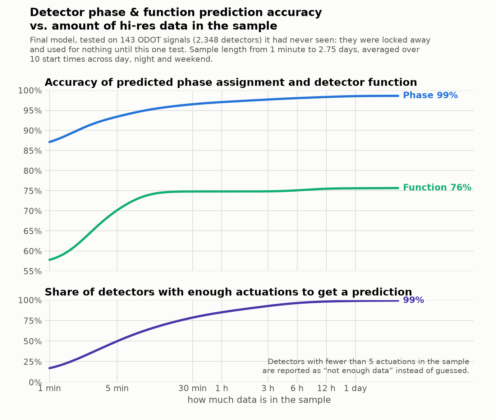

# Detector classifier — final report (`models/final_v1`, 2026-09-21)

**In six lines.** Give this tool raw hi-res controller events and it tells you, for every vehicle
detector channel, which **phase** it is wired to and what its **function** is (Advance / Presence / Count /
Yellow_Red / Other), with a confidence and a plain-English status for each. On 186 signals locked away from
every training and tuning run and opened once at the end, it gets the phase right **98.6 %** from 2¾ days of data,
**98.2 %** from six hours and **97.0 %** from thirty minutes — against the controllers' own timing database.
Function is the weaker half at **.75–.82** (five classes) and
**.78–.85** on the three common ones. It never sees a phase number or a channel number; it judges a
detector purely by how it behaves. It runs on a laptop with numpy, no GPU and no LightGBM install.

---

## 1. What it does, and how well

Input: `DeviceId, Timestamp, EventId, Parameter` — any number of signals, any span from minutes to days. Output:
one row per detector channel with `phase_pred`, `function_pred`, probabilities, and a `status` that says when it
refuses to answer and why.

**The final exam.** 186 signals (43 set aside at the very start of the study, 143 more set aside before the last
round of training) were never used for training, tuning or error analysis — no one looked at a single prediction
on them until the model was finished. They were then scored once, and nothing was changed afterwards. Phase truth is the
controllers' timing database; function truth is the current hand-maintained config table. The old beta of 17
September was re-run on **exactly the same detectors** for comparison.

Phase accuracy (old beta in brackets), and function accuracy at the full window:

| Locked test set | full span | 6 hours | 30 minutes | function: 5 classes / the 3 common ones |
|---|---|---|---|---|
| **143 signals**, Sept 2026, 2,348 detectors | **.986** (.970) | **.982** (.968) | **.970** (.957) | .75 / .78 (beta .52 / .71) |
| **43 signals**, Sept 2026, 941 detectors | **.979** (.974) | **.976** (.967) | **.971** (.961) | .78 / .80 (.66 / .78) |
| **43 signals**, Dec 2024, 834 detectors | .968 (**.973**) | .969 (.970) | **.967** (.959) | .82 / .86 (.73 / .85) |

On the big set the new model makes **less than half** the phase mistakes the beta made (32 errors vs 70 on 2,317
detectors). The one place it loses is the 43 Dec-2024 signals at the full window — 26 errors against the beta's
22, a four-detector difference inside either model's run-to-run noise. Detectors wired **differently from the
ODOT standard** — the ones a lookup table cannot help — improved most: **.973 vs .927** on the 143 signals (751
such detectors).

Function is measured on the detectors that carry a function in the config table — 321, 729 and 711
respectively, far fewer than the phase counts, so read the function column as ±3 points.

Also from that single run (143 signals, full window): 99.4 % of labelled detectors got an answer; keeping only
answers with probability ≥ 0.9 keeps **96 %** of them at **99.5 %** accuracy; 22 of the 32 remaining errors are
the classic concurrent pairs (2↔6, 4↔8 …). Yellow_Red detectors were found with precision 1.00 at recall .71 (n
= 24); "Other" is recalled .69 (the beta managed .09, having no such class).

During development, each of the 375 training signals was scored by a copy of the model trained without that
signal: **.975** with 3 days of data, **.972** at 6 hours, **.959** at 30 minutes. Scored on the very rows it was
fitted on, it reaches .990 — a 1.6-point gap, normal for this kind of model and small enough to rule out
memorising.

### How much data does it need?



| sample length | 1 min | 5 min | 15 min | 30 min | 1 h | 6 h | 1 day | 2¾ days |
|---|---|---|---|---|---|---|---|---|
| phase | .871 | .934 | .957 | .965 | .971 | .980 | .985 | **.986** |
| function (5 classes) | .578 | .701 | .746 | .748 | .748 | .751 | .756 | .757 |
| **detectors answered** | **17 %** | **50 %** | **70 %** | **79 %** | **85 %** | **96 %** | **99 %** | **99 %** |

Read the two panels together. More time mainly buys you **more answered detectors**, not better ones: past about
fifteen minutes both lines are nearly flat, while the share of detectors busy enough to be classified keeps
climbing. This is the same 143-signal exam, cut 25 ways: every point is a full run from raw events, each sample
length measured from the same ten start times so the points share their sampling luck rather than each drawing
fresh. Numbers behind the chart: `img/final_accuracy_vs_minutes.json`.

## 2. How to use it

```bash
pip install -r requirements-inference.txt          # duckdb, pandas, numpy, pyarrow
python src/predict.py --events events.parquet --out preds.csv \
  [--start "2026-09-21 08:00:00"] [--end "..."] [--device-ids <guid>,<guid>] \
  [--chunk-signals 10] [--min-actuations 5] [--min-prob 0.9]
```
```python
import sys; sys.path.insert(0, "src")
from predict import predict
out = predict(events_df_or_path, start=None, end=None)
```

**Input.** Columns `DeviceId, Timestamp, EventId, Parameter` (lowercase/underscore spellings accepted),
a DataFrame, a file or a glob, parquet or csv. Everything else — filtering, de-duplication, ON/OFF pairing,
cycles, features — happens inside. Pull exactly what is used:

```sql
WHERE EventId IN (1,7,8,9,10,11,43,44,81,82,83,84,85,86,87,88,131,150,173)
  AND NOT (EventId IN (81,82) AND Parameter > 64)
```

| EventId | name | need | if missing |
|---|---|---|---|
| 82 / 81 | Detector On / Off | **required** | nothing can be classified |
| 1 | Phase Begin Green | **required** | no candidate phases → "cannot classify" |
| 43 | Phase Call Registered | **strongly recommended** | **−18 to −22 pt** phase, −17 pt function |
| 8 | Phase Begin Yellow (green end) | recommended | falls back to 7 |
| 7 | Phase Green Termination | fall-back for 8 | with 7 only (no 8/9/10/11): −0.4 pt phase |
| 10 / 9 | Begin Red Clearance / End Yellow | recommended | falls back to each other |
| 11 | End Red Clearance | used by the function model | −0.2 pt function, weaker Yellow_Red |
| 44 | Phase Call Dropped | optional | −0.5 to −0.9 pt |
| 83–88 | detector restored / fault | optional | only the "detector health" note is lost |
| 131 | Coordination Pattern Change | optional | no measurable effect |
| 150 / 173 | yield point / unit flash | read, not used | no effect |

**Six codes are enough.** A pull of just **1, 7, 43, 44, 81, 82** costs about 0.4 points of phase
accuracy — worth knowing if a statewide pull has to be cheap. The full set only adds the yellow / red-clearance
detail the function model uses.

**Output**, one row per channel: `phase_pred, phase_prob, phase_2nd, phase_2nd_prob, function_pred,
function_prob, status, review_flag, n_actuations, minutes_of_data`, plus the raw opinion even
where no answer is given (`phase_guess, phase_guess_prob, function_guess, function_guess_prob`), `phase_margin`,
the five class probabilities `p_advance, p_presence, p_count, p_yellow_red, p_other`, `n_candidate_phases`,
`health_flag` and `review_reason`.

**Thresholds.** Auto-accept `phase_prob >= 0.9` — that keeps 96 % of the answers at 99.5 % accuracy —
and send the rest to review; `function_prob >= 0.8` is the comparable line. `review_flag` is true whenever
`status` is not exactly `ok`. **When to refuse** — two dials, defaults unchanged from the beta:
`--min-actuations 5` (default) refuses a detector with fewer than five ON events; `--min-prob 0.9` (off by
default) refuses on confidence instead. On the locked sets at 30 minutes the confidence rule answers 88 % of
detectors at **.995** where the actuation rule answers 93 % at **.970** — fewer answers,
2.5 points better; on very short samples it answers *more*, because a two-minute sample can still be
conclusive. Use `--min-actuations 1 --min-prob 0.9` for that service. Either way nothing is lost: the model's
opinion stays in `phase_guess` / `function_guess`.

**No wiring table.** An optional tie-breaker that used the ODOT standard channel-to-phase table was tested and
**removed** from the final model: it gained only +0.1 to +0.5 pt on 30-minute samples (~+0.05 pt on long ones),
was the only part that knew phase numbers, and could hurt at non-standard cabinets. Refusing on confidence
(`--min-prob`) handles the uncertain cases better.

**Footprint.** Models on disk **18 MB**. One signal × 30 min: 0.7 s, ~210 MB RAM. 43 signals × 3 days:
38 s. 143 signals × 2¾ days (51 M events): 135 s. `--chunk-signals N` bounds memory — peak RAM scales with the
chunk, not the job, so a whole state can be processed on a laptop. **LightGBM is not required**: the trees are
plain text files and `src/lgbm_numpy.py` evaluates them with numpy alone, with identical output (verified,
maximum difference 0.0).

## 3. How it works, in plain words

1. **It scores pairs, not detectors.** For each detector it takes every phase that turned green in the
   sample and asks "how well does this detector's behaviour fit *this* phase?" — when it actuates
   relative to that phase's green, yellow and red, whether a phase call follows an actuation within a
   fraction of a second, whether it sits occupied through red, how it behaves when that phase is green
   *and* its usual partner is not. About 260 such measurements, all rates and shares, so a 30-minute and
   a 3-day sample look the same to the model.
2. **It never sees a number.** No phase number, no channel number, no wiring table. Swap the phase
   numbers in the log and the predictions follow them exactly (there is a test for it) — which is what
   lets it work on detectors wired against convention, and at other agencies.
3. **Then the detectors help each other.** A second stage looks at the whole signal at once: which
   channels fire in the same seconds (cars on one approach arrive together), which channels sit next to
   each other, which phases nobody has claimed. Biggest idea in the project: two phases that are
   *always* green together cannot be separated from one detector alone, but they can be separated by the
   company a detector keeps. It removes one in seven of the first stage's errors, one in five of the
   concurrent-pair ones.
4. **The function model** describes the detector against the other detectors on the phase just assigned
   to it. Advance leads the stop-bar loop by ~3 s and calls the phase; Presence sits occupied through
   the whole red; Count never calls and has quarter-second ONs; Yellow_Red is a Count *downstream* of
   the stop bar, still firing into yellow and red clearance; Other is everything else, and is fuzzy.
5. **Then it decides whether to answer at all** — actuation count, detector-health checks and the
   confidence, turned into a `status` sentence.

## 4. What we tried, and what we learned

| What | Verdict | Why, in one line |
|---|---|---|
| 2025 dual-head BiLSTM (the model to beat) | replaced | .953 phase / .909 function on its own hold-out; declines to answer many detectors |
| **LightGBM detector-vs-candidate-phase ranker** | **shipped** | the core: .96 alone, phase-anonymous, trains in minutes |
| **Joint per-signal decoding** | **shipped** | +0.4 pt with days of data, **+1.8 pt with 30 minutes**, 19 % fewer concurrent-pair errors; the biggest single idea |
| **Mixing sample lengths in training** | **shipped** | +6 pt at 30 min over training on long windows only; one model serves all durations |
| **Phase call events 43/44** | **essential** | remove them and accuracy collapses 10–20 pt — the strongest feature family by far |
| Six event codes (1,7,43,44,81,82) | enough | events 8–11, 131/150, 83–88 are worth ~0.0 pt for phase; a cheap statewide pull works |
| **Official controller timing as the phase truth** | **shipped** | +41 % more labelled channels and +0.27 pt over hand labels, for free |
| **More training signals** (375 → 709) | **shipped** | +0.37 pt at 30 min, nothing at 72 h — variety buys short-sample robustness, not a higher ceiling |
| **3-seed bagging of the ranker** | **shipped** | halves run-to-run noise; the accuracy gain itself is only +0.03 pt |
| **Trained "Other" and "Yellow_Red" classes** | **shipped** | +5.7 pt over a confidence threshold for Other; Yellow_Red costs nothing and is found at precision ~.9 |
| ODOT standard-wiring tie-breaker | **removed** | +0.1 to +0.5 pt at 30 min; of 150 switches it helped 143 and hurt 6 — all 6 non-standard |
| Neural nets reading the raw second-by-second trace: GRU, TCN, conv-GRU, transformer, 2-D cycle CNN | **not shipped** | 30 min / 3 days: .935/.980, .931/.980, .936/.976, .899/.970, .858/.962 — level with the trees at best, and they need a deep-learning library at inference. The nets must rediscover from raw traces what the trees are handed ready-made |
| **Averaging the LightGBM and GRU answers** | **not now — but the best open lead** | +0.19 pt with days of data, **+0.94 pt at 30 minutes** (a plain 50/50 average, consistent across four start times): at short samples the two models make genuinely different mistakes. Left out of this release because everything was already frozen and exam-scored |
| Optuna tuning (~60 trials, 11 knobs); XGBoost / CatBoost / forests; pruning 261 features to 70 | no gain | tuning +0.05 pt (noise); XGBoost −0.29 pt, forests 1.4–2 pt behind; pruning −0.09 pt for a third of the size |
| Peak vs off-peak demand contrast | no | +0.23 pt looked shippable until a shuffled-noise control reproduced +0.16 pt of it |
| Binned (15-second) occupancy instead of exact intervals | worse | −0.3 pt; quantising destroys the 0.2–2 s detail that separates Count from Presence |
| Detector-health masking, and a learned trust score | no | masking the flagged periods changes nothing; the model's own probability is already the best "is this right" ranking |
| Overlaps as a predictable class | not learnable | 73 % of overlaps have a green almost identical to a phase's, and they have no call events |
| Delay / extend settings | red herring | extend is invisible in the log; knowing the true values adds nothing to accuracy or confidence |
| Running inputs through the `atspm` library first | no | its 15-minute bins destroy the sub-second timing that carries the phase signal; raw + de-duplicate is better |

## 5. For ODOT staff — what the labels themselves told us

The files named here are in the working folder `review/` and are **not published with the code** (they
carry device IDs and internal channel descriptions); they are handed over directly.

* **Hand-maintained config vs controller timing: 97.2 % agree** — 151 of 5,469 shared channels differ,
  and the disagreement is stable over 21 months, so it is label noise, not config drift. Full comparison:
  `review/hand_vs_timing_discrepancies.xlsx`.
* **Where they disagreed, the model was right more often than the hand file — 61 to 41**, and on whole
  signals that looked renumbered, 16 to 0. About 40 % of what looked like model error was the config file.
* **`review/official_vs_model_disagreements.csv` (193 rows)** — channels where the model is ≥ 80 %
  confident against the *programmed* phase, each with an evidence sentence for a field check. Twenty-one carry a
  phase number in the technician's own channel description, and four of those back the model (one reads "RadB Ph7
  Count" while the plan calls phase 6).
* **`review/function_vs_config_disagreements.csv` (top 300 of 509)** — confident function disagreements.
  Of 387 flagged a week earlier, the newly pulled config table has since moved to agree with the model on 47
  (about one in eight was a genuine label error).
* **`review/dead_detectors.csv` (333 rows)** — zero-actuation, stuck-on and near-zero-volume channels.
  **Eight signals emit no detector data at all**: a comms or cabinet check, not a labelling question.
* `review/README.md` says how to send corrections back (fill `correct_phase` / `correct_function` and
  `comment`, return the same file).

## 6. Limits, and what would help next

* **Function is the weak half** (.75–.85) and nearly all of the gap is the "Other" bucket — bike loops,
  mid-block loops, "advance presence" channels that behaviourally *are* both. The three common classes alone are
  .78–.86. Function truth is one hand-maintained file with no second opinion, so part of this is the label, not
  the model.
* **Detectors wired against the ODOT standard** are still the harder group (.92–.97 vs .99 for standard
  ones), though the gap narrowed a lot this round.
* **Concurrent pairs remain the main phase error** — two thirds of what is left is 2↔6 and its cousins,
  phases that are green together almost all the time.
* **Trained on ODOT signals only**, Indiana enumerations, three December weekdays plus one September
  weekend. Nothing in the method is ODOT-specific (no wiring table is ever a model input) — but that is an
  argument, not a measurement.
* **No distance or detector-length labels exist.** The config table's `Distance` column is empty, so
  "how far upstream is this loop" cannot be learned or checked today.
* **One modelling idea is still on the table.** Averaging this model's answers with the neural network's
  is worth nothing with days of data but **+0.9 points at 30 minutes** — at short samples the two make
  genuinely different mistakes. It was left out of this release because everything was already frozen and
  taken to the exam, and it would add a deep-learning library to the install. The comparison covers 4,654
  of the 7,197 labelled detectors, so treat it as a strong lead rather than a finished product.
* **What data would help most, in order:** (1) corrected function labels on a few hundred channels,
  especially the "Other" strings; (2) detector setback distances; (3) another ~700 signals, worth about +0.2 pt by
  the learning curve; (4) five weeks of 15-minute counts if production-grade detector-health flags are wanted —
  three days sees only about one failure in ten.

---

Model card and exact feature lists: `models/final_v1/model_card.json`. Stage-by-stage results: `results/00 … 12`.
The September beta it replaces is described in `docs/BETA_REPORT.md` (model files are in the git history).
